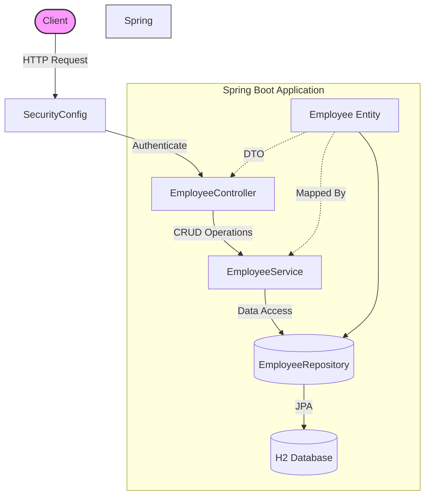

# Employee Management System

A Spring Boot application that provides CRUD operations for managing employee records.

## Architecture



## Features

- CRUD operations for Employee entity (Create, Read, Update, Delete)
- In-memory H2 database
- Basic Authentication with Spring Security
- JUnit tests
- Logging framework integration

## Technical Stack

- Java 8
- Spring Boot 2.7.0
- Spring Data JPA
- Spring Security
- H2 Database
- Lombok
- JUnit 5

## Getting Started

### Prerequisites

- Java 8 or higher
- Maven 3.6 or higher

### Running the Application

1. Clone the repository
2. Navigate to the project directory
3. Run the application:
   ```
   mvn spring-boot:run
   ```

The application will start on `http://localhost:8080`

### Authentication

The application is secured with Basic Authentication:
- Username: `admin`
- Password: `admin`

### H2 Database Console

The H2 database console is available at `http://localhost:8080/h2-console`
- JDBC URL: `jdbc:h2:mem:employeedb`
- Username: `sa`
- Password: (leave empty)

## API Endpoints

- GET `/api/employees` - Get all employees
- GET `/api/employees/{id}` - Get an employee by ID
- POST `/api/employees` - Create a new employee
- PUT `/api/employees/{id}` - Update an employee
- DELETE `/api/employees/{id}` - Delete an employee

### Sample Request Body

```json
{
    "name": "John Doe",
    "number": "EMP001",
    "address": "123 Main Street, City"
}
```

## Testing

Run the tests using Maven:
```
mvn test
```

## Logging

Logs are configured to show:
- INFO level for root logger
- DEBUG level for application packages
- Console output with timestamp
